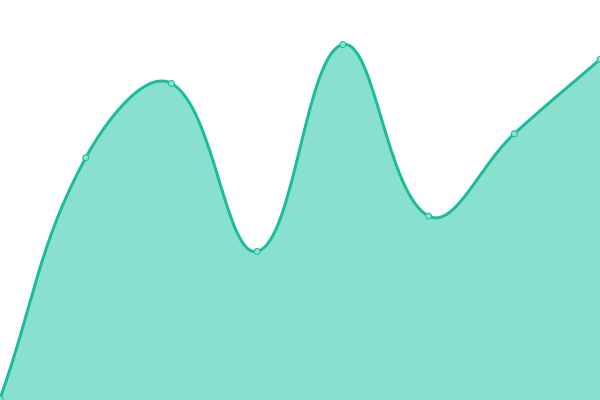

# [📈 Live Status](https://billztcdn.github.io/monitor-website): <!--live status--> **🟧 Partial outage**

This repository contains the open-source uptime monitor and status page for [billztcdn](https://billztcdn.github.io/monitor-website), powered by [Upptime](https://github.com/upptime/upptime).

With [Upptime](https://upptime.js.org), you can get your own unlimited and free uptime monitor and status page, powered entirely by a GitHub repository. We use [Issues](https://github.com/billztcdn/monitor-website/issues) as incident reports, [Actions](https://github.com/billztcdn/monitor-website/actions) as uptime monitors, and [Pages](https://billztcdn.github.io/monitor-website) for the status page.

<!--start: status pages-->
<!-- This summary is generated by Upptime (https://github.com/upptime/upptime) -->
<!-- Do not edit this manually, your changes will be overwritten -->
<!-- prettier-ignore -->
| URL | Status | History | Response Time | Uptime |
| --- | ------ | ------- | ------------- | ------ |
|  [Google](https://www.google.com) | 🟩 Up | [google.yml](https://github.com/billztcdn/monitor-website/commits/HEAD/history/google.yml) | 

 200ms
     
 | 

<a href="https://billztcdn.github.io/monitor-website/history/google">100.00%</a>
    

|  [Wikipedia](https://en.wikipedia.org) | 🟩 Up | [wikipedia.yml](https://github.com/billztcdn/monitor-website/commits/HEAD/history/wikipedia.yml) | 

 161ms
     
 | 

<a href="https://billztcdn.github.io/monitor-website/history/wikipedia">100.00%</a>
    

|  [CottonFGD](https://cottonfgd.org) | 🟥 Down | [cotton-fgd.yml](https://github.com/billztcdn/monitor-website/commits/HEAD/history/cotton-fgd.yml) | 

 3506ms
     
 | 

<a href="https://billztcdn.github.io/monitor-website/history/cotton-fgd">88.93%</a>
    

|  [Springwood](https://springwood.me) | 🟩 Up | [springwood.yml](https://github.com/billztcdn/monitor-website/commits/HEAD/history/springwood.yml) | 

 247ms
     
 | 

<a href="https://billztcdn.github.io/monitor-website/history/springwood">100.00%</a>
    

|  [Springwood-JP](https://jp.springwood.me) | 🟩 Up | [springwood-jp.yml](https://github.com/billztcdn/monitor-website/commits/HEAD/history/springwood-jp.yml) | 

 214ms
     
 | 

<a href="https://billztcdn.github.io/monitor-website/history/springwood-jp">100.00%</a>
    

<!--end: status pages-->

[**Visit our status website →**](https://billztcdn.github.io/monitor-website)

## 📄 License

- Powered by: [Upptime](https://github.com/upptime/upptime)
- Code: [MIT](./LICENSE) © [billztcdn](https://billztcdn.github.io/monitor-website)
- Data in the `./history` directory: [Open Database License](https://opendatacommons.org/licenses/odbl/1-0/)
